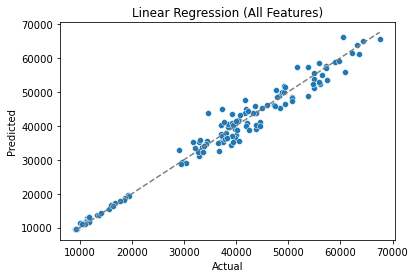

<h1 style="text-align:center">Predicting BTC Closing Value Based on Past 30 days of Data </h1>

 
    Mike Limpus, Michael Hackett, Katie Vickstrom, Josh Hansen  
    <a href='https://github.com/KatherineVickstrom/DataScience'>https://github.com/KatherineVickstrom/DataScience</a>  

## Introduction
Given the volatility of the crypto market at the time of this project, we are interested in seeing if we can predict Bitcoin prices based on the historical and recent history of Bitcoin prices. We want to predict 'tomorrow's' closing price based on the past 30 days closing prices.

## Choice of dataset
We selected a dataset from <a href='https://www.investing.com/crypto/bitcoin/historical-data'>Investing.com</a>  where we chose the timeframe of Bitcoin historical price data from 6/4/2020-6/4/2022. This was then uploaded to our project Github as there is no direct link to a CSV file on their site. <a href='https://raw.githubusercontent.com/KatherineVickstrom/DataScience/main/Bitcoin_Historical%20Data_%20Investing_com_20200604_20220604.csv' style='font-size: .8rem'> (Link to GitHub)</a>   
It is important to note that our chosen data set represents prices at a single point in time during the day. A more in-depth look could use data by the second, but this is out of scope for this project.  

We modified the dataset to drop time-series data in order to simplify the data for our testing methodology. This left us with 4 columns: 
- Open, the price at the beginning of the day
- High, the highest price during that day 
- Close, the price at the end of the day
- Vol., the amount of Bitcoin traded during the day, measured in Bitcoin rather than USD

These columns were then converted into 30 Day Averages and renamed to 
- Open_Avg_30_Day
- High_Avg_30_Day
- Low_Avg_30_Day
- Vol_Avg_30_Day

## Methods
Our project used a standard data science Python stack. We used NumPy and Pandas for data processing, Seaborn for plotting, and SciKit-Learn for machine learning tools. The machine learning algorithms used were Linear Regression and Lasso, which is a variation of Linear Regression. We applied a standard scaler to our data before training.

## Results
We were able to construct a model which fits the actual figures with an R2 value of 0.976. This was achieved with a linear regression model using every predictor in our dataset.      Using this model, we were able to 'predict' the value of Bitcoin for June 5th, 2022 with an error of 4.2%. 

## Discussion
We were able to construct an accurate model to predict Bitcoin prices without time series data and using simple 30-day averages. This method is different than some other researchers with similar goals. One such researcher1 used linear regression to predict the price using a dataset with 4,857,377 rows (compared to our 674). Their model had an R2 value of 0.99 (versus our 0.976) and used time series data. We were able to create a model comparable to others without having to use millions of rows of data.  

## Summary 
We examined different methods of using linear regression in order to fine tune our model to predict prices as accurately as possible. We found that using more meaningful features yielded better results for our predictions. Using our best-tuned model, we were able to predict the price of Bitcoin within a 5% error. 
### References 
1) 💰Bitcoin Price Prediction using Linear Regression, _HackerDawn_, Sidharth Pandita
https://medium.com/hackerdawn/bitcoin-price-prediction-using-linear-regression-94e0e5a63c42
